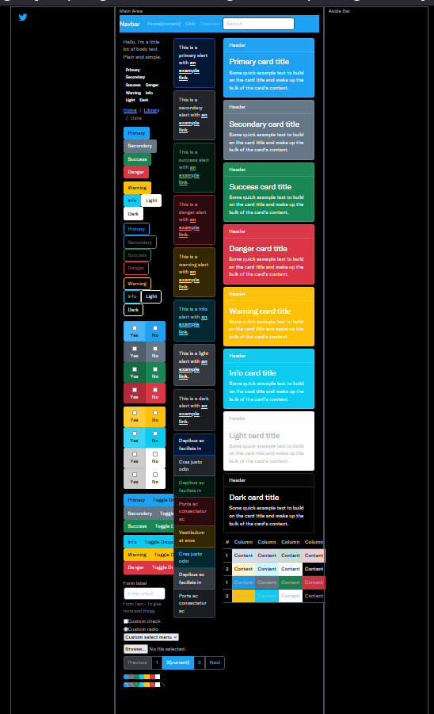
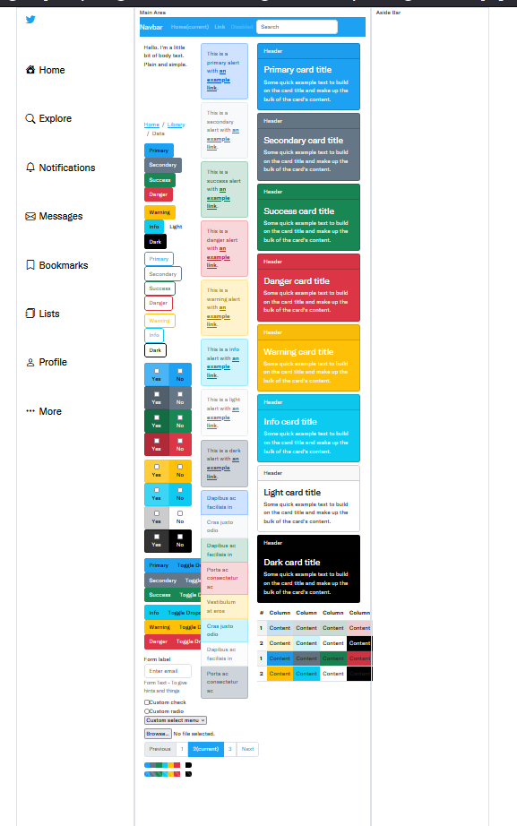

# Twitter Project 🎊

### طريق تشغيل المشروع

- قم بتنزيل النسخة من المستوع علي جهاز باستخدام الامر `git clone`
- أدخل الي مجلد المشروع بأستخدام الامر `cd twitter-clone`
- ثم قم بتشغيل الأمر `npm i` لتقوم بتنزل المكتبات الخاص بالمشروع
- وأخير قم بتشغيل الأمر `npm start ` لتشغيل المشروع

[Database Digram](http://www.plantuml.com/plantuml/umla/fLNBJiCm4BpxAqovW0GI8FL0Jlm7WiYDDtI57v6pBI34lsCxBoUaD9JaaexjcV5ulNseIJZQQSNO6Mr10w-KGCF8LfmitrWYgxb41mMXDQn-HLC99pHNQ80-Ak3MqTOoLYXHrxomMeCX_iauv_G6G7dvcd4q12_W0kZ0AtnCqLqDReeLrdyRoZZ1EqN0WI38HO1GWxUkgsPY5CrH3kk_nePo3H95Owk39dAenGiCOdkKO1Fjb6TMAL7umyP_LpsivgE89z88piNNc4ZNHXFDiZmSNSRtmXLRuIxkrfUZqNd5uF-Otgbdw3zebpYwlRcvJ5ARCnG53_ivMReDusT-Wp0IUS6WEkWReMVybpkbyl7GtReP0YrG_OHbC6dBV8F-OcNnvs_kiSx3eUszmCPQ1SAqg9zHbbDGI8rc1CRevdOP1ofdIrHmE6KXfOEwxhSHi0qc9Jmfy9Hr8ikwvj4-ru_dw_lmNiMUz7Jzt9L3DoFZg-5MzPMoMaBK54z2r9TlT-uBQP9I23HTHcsiFKdRW6P9nZgU9EbGGszRiPRY__ai85gIJz-3_aopUFMnTCVx_STE5j0Syp8MEf5aTEjE9Na08yD_-ZS0)

# Theme Kit

### Dark 🌓

### Light

